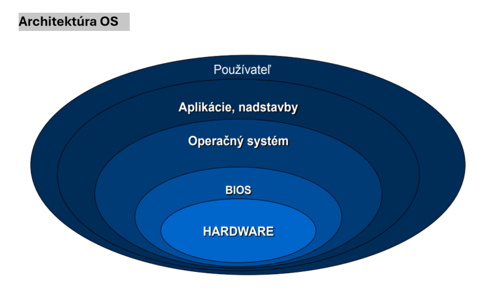

# ***Operačné Systémy*** - je sada programov, ktoré slúžia na uľahčenie práce s počítačom. Základný softvér na PC. #čotoje #card #titlecard
card-last-interval:: 4
card-repeats:: 1
card-ease-factor:: 2.6
card-next-schedule:: 2024-10-18T09:07:33.449Z
card-last-reviewed:: 2024-10-14T09:07:33.449Z
card-last-score:: 5
- # **OS vytvára rozhranie** (textové a/alebo grafické) medzi HW a SW PC a medzi pouzivatelom a PC.#rozhranie #card
  card-last-interval:: 4
  card-repeats:: 1
  card-ease-factor:: 2.6
  card-next-schedule:: 2024-10-18T09:08:21.286Z
  card-last-reviewed:: 2024-10-14T09:08:21.286Z
  card-last-score:: 5
- # **Riadi** beh ostatných procesov tzn. ostatným procesom bezpečne a efektívne odovzdáva riadenie a získava ho späť. #corobi #card
- # **Funkcie zabezpečované OS:** #funkcie #card
	- komunikácia s používateľom prostredníctvom periférií,
	- prideľovanie prostriedkov systému používateľom alebo aplikáciám (pamäť, výkon ...),
	- prideľovanie času používateľom alebo procesom,
	- organizácia programov a súborov údajov na vonkajších pamäťových médiách,
	- vytváranie a spúšťanie používateľských programov,
	- diagnostické funkcie
	- autokontrola systému,
	- možnosť analýzy a odstraňovania chýb,
	- zabezpečovacie funkcie
	- ochraňuje systém proti strate údajov pri výpadku napätia,
	- proti neoprávnenej alebo neodbornej manipulácii,
	- komunikácia s inými počítačmi v sieti.
- # **Časti OS:** #parts #card
  card-last-interval:: 4
  card-repeats:: 1
  card-ease-factor:: 2.6
  card-next-schedule:: 2024-10-18T09:08:17.374Z
  card-last-reviewed:: 2024-10-14T09:08:17.374Z
  card-last-score:: 5
	- ## *Jadro operačného systému:*
		- zabezpečuje prideľovanie prostriedkov,
		- správu súborov, poskytuje podporu pre ostatné súčasti OS;
		- je rezidentne (trvalo) umiestnené v operačnej pamäti počas behu PC.
	- ## *Monitor operačného systému:*
		- tiež nazývaný interpreter príkazov;
		- zabezpečuje komunikáciu systému s používateľom, prijíma a analyzuje vstupy/ impulz z klávesnice, myši (grafického rozhrania),
		- zisťuje význam systémových príkazov, vypisuje príslušné odozvy na zobrazovacie (výstupné) zariadenie.
	- ## *Ovládače, obslužné programy Input/Output zariadení (periférií):*
		- obslužné programy/ovládacie programy - umožňujú komunikáciu medzi technickým zariadením počítača a operačným systémom
- # **Architektúra OS:** #card #architecture
  card-last-interval:: 4
  card-repeats:: 1
  card-ease-factor:: 2.6
  card-next-schedule:: 2024-10-18T09:08:13.432Z
  card-last-reviewed:: 2024-10-14T09:08:13.432Z
  card-last-score:: 5
	- 
	- Operačný systém má spravidla hierarchickú (vrstevnú) architektúru
	- Vrstva na najnižšej úrovni zaisťuje priamy styk s technickými prostriedkami (hardware) osobného počítača - táto vrstva sa nazýva BIOS (Basic Input Output System = základný vstupno/výstupný systém).
	- Služby BIOS-u používa samotné jadro operačného systému. Pri niektorých činnostiach môže jadro OS voliť priamy prístup na technické prostriedky a tým pádom obísť štandardný BIOS. Tento spôsob však môže niekedy viesť ku nekompatibilite jadra OS s hardvérom.
	- Služby jadra operačného systému následne potom používajú rôzne nadstavby a hlavne aplikácie (programy) spúšťané pod operačným systémom. Častokrát je používateľské rozhranie vo forme nadstavby OS.
	- Operačný systém predstavuje programové vybavenie, pomocou ktorého výpočtový systém plní svoje základné funkcie.
	- Operačný systém riadi a kontroluje jednotlivé časti technického vybavenia počítača (hardware) a zaisťuje pre aplikácie resp. používateľské programy všetky služby týkajúce sa ovládania technických prostriedkov.
	- V neposlednom rade sprostredkuje operačný systém komunikáciu medzi používateľom a výpočtovým systém t. j. definuje používateľské rozhranie
- # **BIOS - Basic Input Output System:** #card #bios
  card-last-interval:: 4
  card-repeats:: 1
  card-ease-factor:: 2.6
  card-next-schedule:: 2024-10-18T09:08:06.946Z
  card-last-reviewed:: 2024-10-14T09:08:06.946Z
  card-last-score:: 5
	- zabezpečuje základné služby pri prístupe k periférnym zariadeniam,
	- tvorí rozhranie medzi hardvérom a vyššími vrstvami programového vybavenia.
	- Je to rozhranie štandardizované, tzn. že vstupné body a parametre obslužných procedúr OS nezávisia na type hardvéru a sú jednoznačne naviazané na funkcie operačného systému:
		- vykonáva úvodný test po zapnutí počítača,
		- umožňuje nastaviť základné parametre počítača,
		- zavádza operačný systém – poskytuje operačnému systému prostriedky pre realizáciu viac - úlohového prostredia