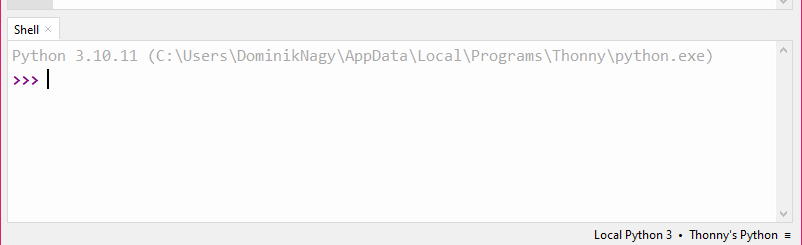
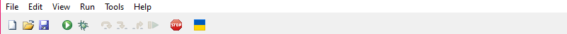
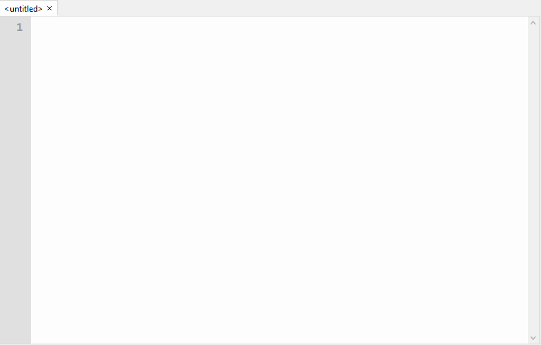
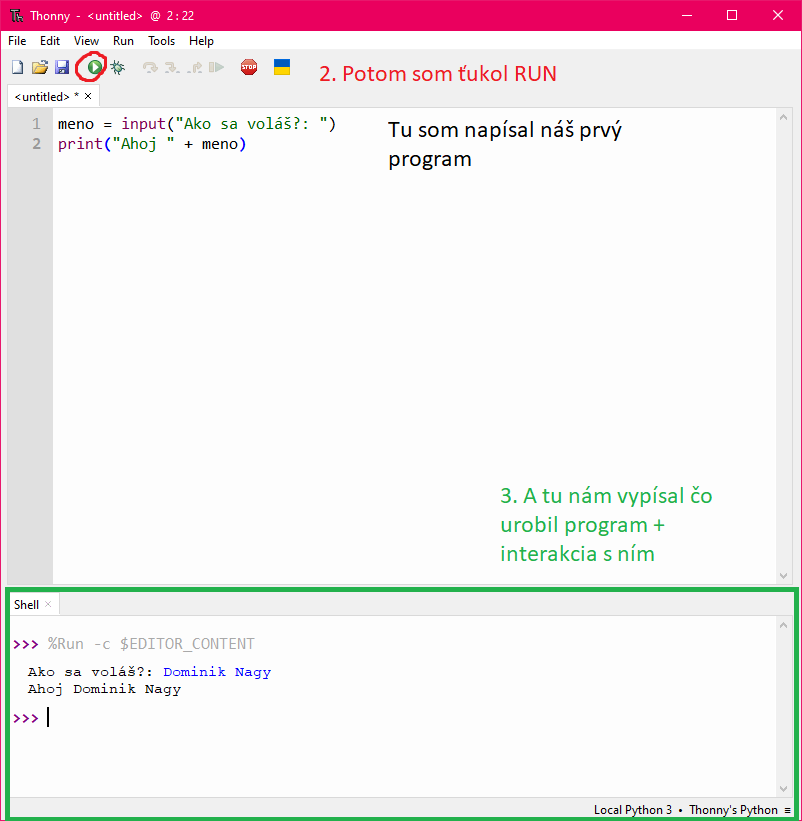
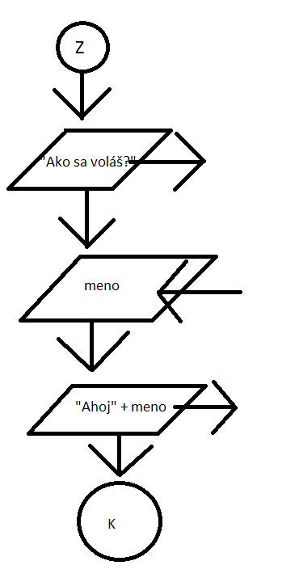

# Python #titlecard #card
	- *Python* je **interpretovaný** programovací jazyk = kód, ktorí napíšeme ide *interpretrovy* (nemení sa na strojový kód) => to znamená, že tento jazyk je pomalší ako kompilované jazyky. #python3
	- Na písanie kódu Python použijeme program Thonny (musíme stiahnuť na kompoch v škole) #IDE
	- ## História #card #history
		- Vytvoril ho Guido van Rossum, keď už vedel jazyky C a C++ a uvedomil si, že sú veľmi tažke na naučenie tak urobil Python v 1989 -1991
		- Pomenoval ho po Monty Pythonovy
		- Za ten čas bol 3-krát prekopaný (teraz verzia 3.1*)
		- Jeho hlavná funkcia je *ľahkosť naučenia*
	- ## Thonny #cosmerobilinahodine #card
		- 
			- Tu vieme pracovať z pythonom v jednom riadku, a písať zakl. operácie (1+1; meno = Fero, meno; ...)
		- 
			- Tu sú zákl. operácie programu
		- 
			- A tu píšeme kód Python
		- 
			- Tu je náš prvý program
			- Print (Komunikácia z použivateľom von)
			- Input (Použivateľ komunikuje z programom)
		- ### Vývojový diagram tohto programu
			- 
			-