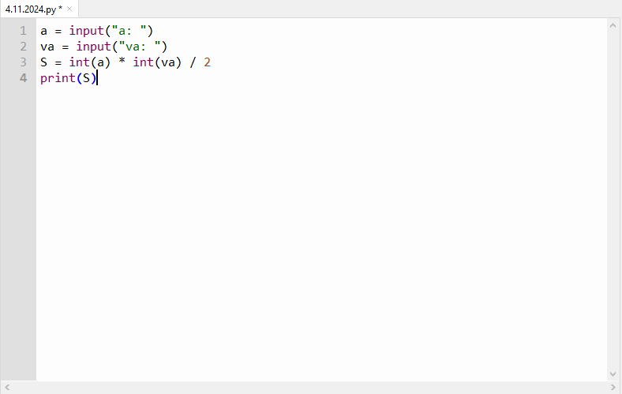
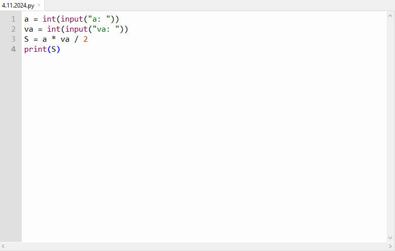
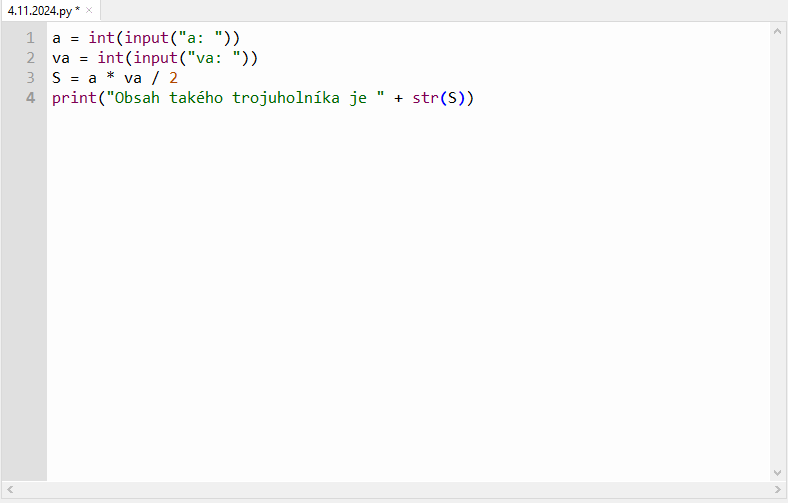
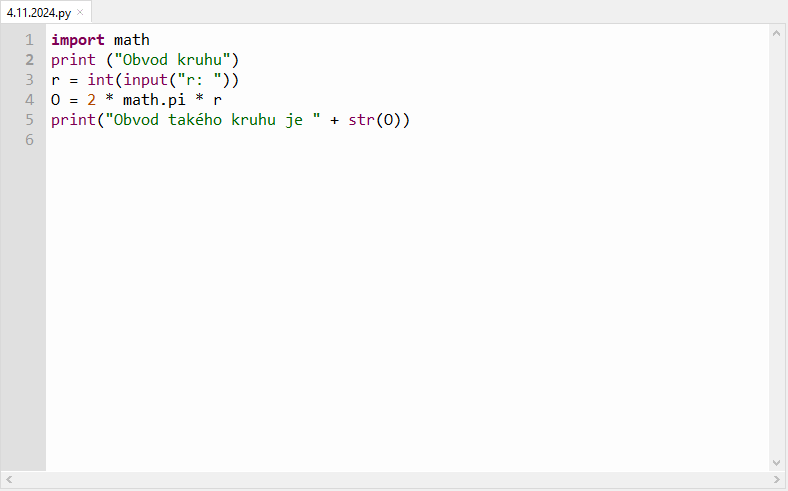
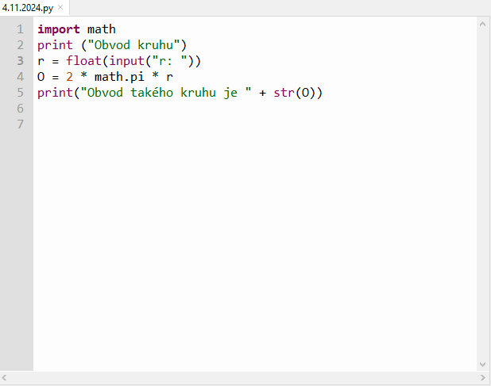
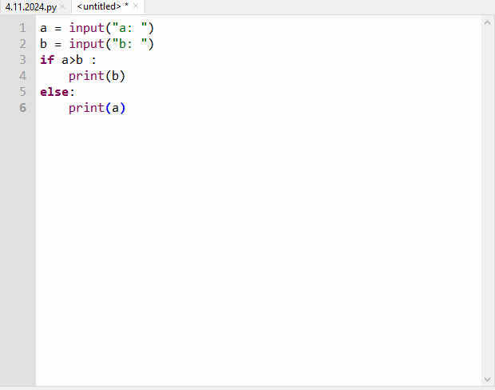
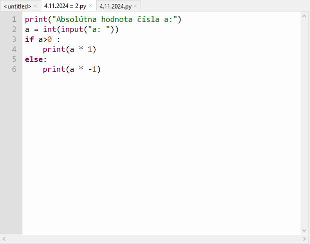

# Audio
	- Referát 1 A4 - Magnetický, mechanický a optický záznam zvuku
	- [Magnetický, mechanický a optický záznam zvuku.docx](../assets/Magnetický,_mechanický_a_optický_záznam_zvuku_1730710796828_0.docx)
- # DGT
	- 
	- 
		- Ako použiť funkciu int() = Zmenenie na čísla ale musí to byť napísane v 10 sústave
	- 
		- Použitie funkcie str() = Zmenenie na text
	- 
		- Obvod kruhu (použil som aj funkciu import, aby som mal pí presné.)
	- 
		- Použitie funkcie float() aby som mohol udať desatinné čísla
	- 
		- Funkcia *if* (ak) ... *:* (then (skratka tak)) , *else* (ak nie) ... *:* (tak)
	- 
		- [4.11.2024 = 2.py](../assets/4_1730713925763_0.11.2024 = 2.py)
		- [4.11.2024.py](../assets/4_1730713931213_0.11.2024.py)
		- {:height 498, :width 622}
		- 
			- Funkcia elif() na hlbšie vetvenie