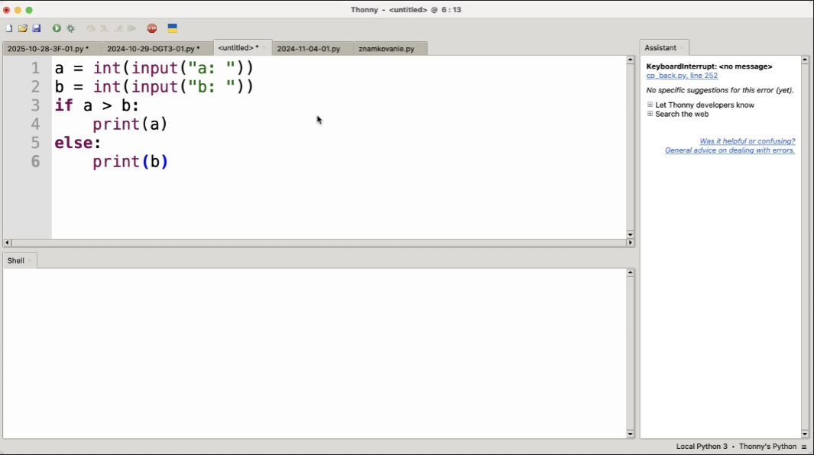
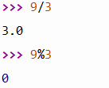
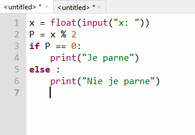
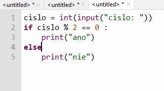
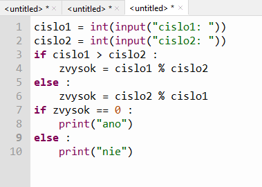

# DGT
	- Premenná v Pythone môže byť hocičo len nemôže mať medzeru, citlivé na malé a veľké písmená, nemôže začínať číslom, nemôže ti nahradiť funkciu napr. a = print **NIE**
	- Taktiež nemôže to byť if, else a elif,
	- 
	- 
		- Delenie v python nám dá desatinné číslo (nie celé ako pri +,-,*)
		- Desatinné čísla vyjadrujeme funkciou float() (z angl. floating point number)
		- **47**x10^**-1** = 4,7
			- *semilogaritmický* = nepresné pracovanie z desatinnými číslami (lebo PC vie pracovať iba z celými a potom +/- hýbe desatinnou čiarkou čím viac desatinných miest tým menej presné)
		- Najvačšie číslo pomocou semilogaritmického tvaru v 64-bitovo PC je **(2^65-1)**x10^**(2^65-1)**
	- 
		- Delenie ale výsledok je celý (zlý spôsob)
		- 
			- Operand **//** nám pri delený dá vždy dá celé čislo
		- 
			- Zvyšky delenia **% = modulo**, nebude *nikdy* väčšie ako deliteľ
			- Používame keď chceme zistiť či sa dá číslo deliť tým číslom (pokial výde 0)
		- ### Príklad
			- Vypíš či je číslo párne
				- 
				- 
				- 
				-
-