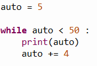
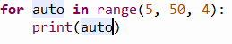

# AUD
	- rozprávka Mrázik dvojica Štrbák a Nagy
	- [Mrázik SK dabing, 1964 HD, ( orig. Морозко – Morozko)](https://www.youtube.com/watch?v=Nyv1y2qmrKo)
	- Čo ti šije ty hlupák starý
- # DGT
	- 
		- auto = riadiaca premenná
	- 
	- # ASCII
		- je kódovanie znakov podľa tabuľky
		- v pythone funkcia **chr()** = premena čísla na text skrz ascii
		- má 255 znakov je americký štandard
		- v pythone funkcia **ord()** = premena charakteru na číslo