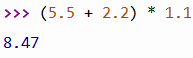

# Kapitola 1 - Cvičenia
	- ## Cvičenia – Matematické operácie na celých číslach
		- Zoznámenie sa:
		  logseq.order-list-type:: number
			- 
			- 
			- 
		- Základy:
		  logseq.order-list-type:: number
			- 
			  logseq.order-list-type:: number
			- 
			  logseq.order-list-type:: number
			- 
			  logseq.order-list-type:: number
		- Precvičovanie:
		  logseq.order-list-type:: number
			- 
			  logseq.order-list-type:: number
			- 
			  logseq.order-list-type:: number
			- 5 + je posledné číslo v postupnosti krát a delenie má prednosť najprv sa násobí potom idem zvyšok a nakoniec sa pripočíta 5
			  logseq.order-list-type:: number
	- ## Cvičenia – Matematické operácie na desatinných číslach
		- Zoznámenie sa:
		  logseq.order-list-type:: number
			- 
			  logseq.order-list-type:: number
			- 
			  logseq.order-list-type:: number
			- 
			  logseq.order-list-type:: number
		- Základy:
		  logseq.order-list-type:: number
			- 
			  logseq.order-list-type:: number
			- 
			  logseq.order-list-type:: number
			- 
			  logseq.order-list-type:: number
		- Precvičovanie:
		  logseq.order-list-type:: number
			- 
			  logseq.order-list-type:: number
			- 
			  logseq.order-list-type:: number
			- 
			  logseq.order-list-type:: number
	- ## Cvičenia – Konverzia medzi celými a desatinnými číslami
		- Zoznámenie sa:
		  logseq.order-list-type:: number
			- 
			  logseq.order-list-type:: number
			- 
			  logseq.order-list-type:: number
			- 
			  logseq.order-list-type:: number
		- Základy:
		  logseq.order-list-type:: number
			- 
			  logseq.order-list-type:: number
			- 
			  logseq.order-list-type:: number
			- 
			  logseq.order-list-type:: number
		- Precvičovanie:
		  logseq.order-list-type:: number
			- 
			  logseq.order-list-type:: number
			- 
			  logseq.order-list-type:: number
			- 
			  logseq.order-list-type:: number
	- ## Cvičenia – Operácie s reťazcami: zreťazenie a násobenie