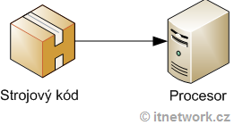
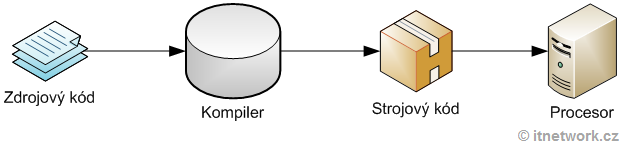
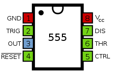
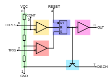
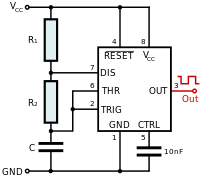
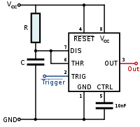

# Základný rozdiel medzi mikroprocesorom a mikrokontrolérom #rozdiel-medzi-mikroprocesorom-a-mikrokontrolerom
	- *Mikroprocesor* je obyčajne **iba jadro**. Je to *CPU* a **niekedy** doplnené *pamäťovým radičom* a ničím iným. Používa sa s *inými komponentmi*, ako sú **pamäťové moduly** (pre dátovú aj programovú pamäť), pamäťové zariadenia a vstupné / výstupné periférie. Typickými komponentmi, ktoré nájdete v mikroprocesore, sú *ALU, registre, načítavacie a dekódovacie jednotky atď*.
	  logseq.order-list-type:: number
	- *Mikrokontrolér* je jediný **integrovaný obvod**, ktorý obvykle obsahuje malé jadro procesora, program a **dátovú pamäť a programovateľné periférie vstupu / výstupu**. *Mikrokontroléry* sú zamerané na *vstavané aplikácie*, na rozdiel od *mikroprocesorov*, ktoré sú zamerané na osobné počítače. Vo všeobecnosti majú *mikrokontroléry pamäť (programová pamäť a niektoré RAM), IO porty, počítadlá, UART*, všetky integrované do **jedného čipu**.
	  logseq.order-list-type:: number
- ## Základné časti mikroprocesora #mikroprocesor #zakladne-casti
	- **ALU (Aritmetic Logic Unit — Aritmeticko logická jednotka)** #ALU:
	  id:: 68e3faee-2a78-4486-afe9-b429d444b29b
		- základná a veľmi dôležitá súčasť každého mikroprocesora, táto jednotka vykonáva operácie ako sčítanie, odčítanie, logické posuny, porovnávanie a logické operácie (AND, OR, NOT, atď.), bez nej by mikroprocesor nemohol fungovať..
	- **Register** #register:
		- slúži pre uchovanie a rýchle čítanie/zapisovanie operandov alebo stavov mikroprocesora, zväčša ich je v mikroprocesore *viacero, zväčša v pároch*, niektoré môžu mať špeciálne funkcie.
	- **Control Unit — Riadiaca jednotka**: #control-unit
		- riadi všetky procesy v mikroprocesore, pre jej správnu funkčnosť musí byť taktovaná danou frekvenciu, bez toho by taktiež mikroprocesor vôbec nefungoval, obsahuje sekvenčnú a kombinačnú logiku.
- ## Základné časti mikrokontroléra #mikrokontrolér #zakladne-casti
	- **CPU**: #cpu
		- mozog mikrokontroléra, vykonáva inštrukcie, spája všetky časti mikrokontroléra do celku
	- **Pamäť**: #pamat
		- slúži pre uchovanie dát a programu, mikrokontrolér má pamäť rozdelenú na *ROM* (pevná pamäť) a *RAM* (rýchlo prístupná, možno do nej zapisovať a čítať údaje)
	- **Vstupno-výstupné porty**: #vstupno-vystupne-porty
		- slúžia na riadenie a obsluhu externých zariadení ako *LCD displej, LED-ky, motorčeky, atď.*
	- **Sériový port**: #seriovy-port
		- slúži na komunikáciu s *externými zariadeniami*
	- **Čítače/ časovače**: #citace/casovace
		- slúžia pre časovanie vnútri procesora, *z ich použitím sa dajú vytvárať rôzne modulácie, generovanie pulzov, meranie frekvencie, atď.*
	- **DAC/ADC prevodníky** #DAC/ADC
		- **DAC (digitálno-analógové) - ** #DAC
			- slúžia napr. k riadeniu motorov, ako *výstup akustického alebo video signálu, atď.*
		- **ADC (analógovo-digitálne) - ** #ADC
			- slúžia k *meraniu* rôznych hodnôt ako napr. napätia, teploty, osvetlenia, atď.
	- **Ovládanie prerušenia**: #prerusenie
		- využíva sa pri *chode* programu, môže byť interný alebo externý
- ## Typy zariadení (prvkov) môže obsahovať mikroprocesorový systém #mikroprocesor #zariadenia
	- RAM, ROM, obvod pre riadenie portov, komunikáciu, čítače, podporné obvody, radiče, periférie
- ## Periférne zariadenia, ktoré môže obsahovať mikrokontrolér alebo mikroprocesorový systém #mikroprocesor #mikrokontrolér #periferne-zariadenia
	- Čítače, prevodníky, obvody kt. obstarávajú prerušenie, obvody pre sériovú komunikáciu, atď.
- ## Využitie mikrokontroléra a mikroprocesora z praxe #prax #mikroprocesor #mikrokontrolér
	- **Mikrokontroléry**:
		- PLC jednotky
		- jednoúčelové prístroje (meracie prípravky, ovládače motor, riadiace elektronika v TV)
		- periférne zariadenia (klávesnica, myš, tlačiareň)
	- **Mikroprocesory**:
		- mikropočítače
		- kalkulačky
		- riadiace jednotky
		- meracie prístroje
		- vesmírne sondy
- ## RAM, ROM, CPU, ALU, register #rozdiely-ram-rom-cpu-alu-register
	- **RAM (Random Access Memory)**: #ram
		- pamäť s náhodným/ľubovoľným prístupom - slúžia na ukladanie údajov, ktoré počítač potrebuje na spracovanie práve vykonávanej úlohy
	- **ROM (Read Only Memory - Permanentná pamäť)**: #rom
		- ROM sa používa na trvalé uchovanie údajov
	- **CPU (Central Processing Unit - Centrálna výpočtová jednotka)**: #cpu
		- CPU interpretuje a vykonáva inštrukcie obsiahnuté v softvéri a vykonáva výpočty
	- **ALU (Aritmetic Logic Unit – Aritmeticko-logická jednotka)**: #alu
		- je centrálna časť procesora v ktorej sa vykonávajú základné aritmetické a logické operácie s číslami
	- **Register**: #register
		- slúži pre uchovanie a rýchle čítanie/zapisovanie operandov alebo stavov mikroprocesora, zväčša ich je v mikroprocesore viacero, zväčša v pároch, niektoré môžu mať špeciálne funkcie
- ### Programovacie jazyky, ktoré sa môžu používať pri programovaní mikrokontrolérov #programminglanguage
	- **Jazyky**:
		- napr. Python, C, Assembler
- ## Zariadenia, kde sa používajú mikrokontroléry a mikroprocesory #kdesapouzivaju #mikroprocesor #mikrokontrolér
	- **Mikrokontroléry**: #mikrokontrolér
		- PLC jednotky
		- jednoúčelové prístroje (meracie prípravky, ovládače motor, riadiace elektronika v TV)
		- periférne zariadenia (klávesnica, myš, tlačiareň)
	- **Mikroprocesory**: #mikroprocesor
		- mikropočítače
		- kalkulačky
		- riadiace jednotky
		- meracie prístroje
		- vesmírne sondy
- ## Triedenie zariadení na vstupné a výstupne #vstupne-vystupne-zariadenia
	- **Vstupné**:
		- klávesnica
		- myš
		- A/D prevodník
		- Hallov snímač
		- Tenzometer
		- mikrofón
	- **Výstupné**:
		- D/A prevodník
		- LED dióda
		- reproduktor
		- LCD displej
- # Logické funkcie #logicke-funkcie
	- **Jednoduché kombinačné obvody (hradlá)** - slúžia na realizáciu základných logických operácií a základnými sú: #jednoduche-kombinacne-obvody #hradla
		- hradlo NOT,
		- hradlo AND, NAND,
		- hradlo OR, NOR,
		- hradlo XOR, XNOR,
		- hradlo AND OR INVERT.
	- **Zložitejšie kombinačné obvody (aritmetické jednotky)** - slúžia na realizáciu zložitejších aritmetických logických operácií a základnými sú: #zlozitejsie-kombinacne-obvody #aritmeticke-jednotky
		- sčítačka,
		- násobička,
		- multiplexor, demultiplexor,
		- prepínač,
		- komparátor,
		- kóder, dekóder,
		- generátor parity,
		- aritmeticko – logická jednotka.
	- **Jednoduché sekvenčné obvody (preklápacie resp. klopné)** - ďalej delíme podľa stavov na: #jednoducke-sekvencne-obvody #preklapacie #klopne
		- *bistabilné (Flip-flop)*: #bistabilne #flip-flop
			- ktoré majú dva stabilné stavy, žiaden nestabilný stav
			- nachádzajú sa v jednom zo stabilných stavov a z jedného stabilného stavu do druhého stabilného stavu ich možno preklápať vstupom;
		- *monostabilné (Monoflop)*: #monostabilne #monoflop
			- ktoré majú jeden stabilný stav a jeden nestabilný stav
			- nachádzajú sa v stabilnom stave, do nestabilného stavu ich možno preklopiť vstupom a obvod sa po čase sám preklopí do stabilného stavu;
		- *astabilné alebo multivibrátory (Multivibrators)*: #astabilne #multivibratory #multivibrators
			- ktoré majú dva nestabilné
			  stavy, žiaden stabilný stav
			- periodicky sa medzi týmito dvoma nestabilnými stavmi preklápajú, pričom doba, počas ktorej obvod zotrváva v danom stave sa nazýva časovou konštantou stavu, ktorá môže byť pre oba stavy rovnaká (symetrický obvod) alebo rôzna (nesymetrický obvod)
- # Assembler #assembler
	- ## Vývoj programovacích jazykov #vyvoj
		- ### 1. generiácia jazykov: #1generacia
		  logseq.order-list-type:: number
			- *Procesor počítača* vie vykonávať len *obmedzené množstvo* jednoduchých inštrukcií, ktoré sú uložené ako *sekvencie bitov, sú to teda čísla.* 
			  logseq.order-list-type:: number
			- Tá sa mu obvykle zadávajú *hexadecimálnej (šestnástkovej) sústave*. Inštrukcie sú tak elementárne, že umožňujú iba napr. prácu s *registrami procesora* **(to je pamäť v CPU)** alebo **skoky**. 
			  logseq.order-list-type:: number
			- Nie je možné *napr. jednoducho sčítať dve čísla*, **musíme sa na čísla pozerať ako na adresy v pamäti** a *také sčítanie čísel zaberie niekoľko inštrukcií*.
			  logseq.order-list-type:: number
			- Inštrukcie sa procesoru predložia v *binárnej* podobe. Takýto kód je samozrejme **extrémne** nečitateľný a závisí od *inštrukčnej sady daného CPU*.
			  logseq.order-list-type:: number
			- Každý počítačový program musí byť nakoniec do tohto jazyka *preložený*, aby mohol byť na procesore počítača **spustený**.
			  logseq.order-list-type:: number
			- 
			  logseq.order-list-type:: number
		- ### 2. generácia jazykov: #2generacia
		  logseq.order-list-type:: number
			- **Assembler** alebo **JSA (Jazyk Symbolických Adries)** sa objavil niekedy v polovici *20. storočia*. Konkrétne sa jednalo o jazyk *druhej generácie*. 
			  logseq.order-list-type:: number
			- Od jazykov prvej generácie sa líšil tým, že namiesto toho, aby sme si museli *pamätať číselné kódy inštrukcií*, sme mohli písať ich **slovné kódy**.
			  logseq.order-list-type:: number
			- Vďaka **Assembleru** bolo písanie *programov jednoduchšie a prehľadnejšie*, než keby sme ich písali v *číslach*. Ďalšou výhodou bolo, že *adresy v programe sa nemuseli meniť* **prepisovaním celého programu ako tomu bolo u prvej generácie.** 
			  logseq.order-list-type:: number
			- Čo sa týka kódu *samotného*, ​​nemuseli sa opäť napr. zložito vypočítavať **adresy skokov**. Kód teda začal byť **vôbec ľudsky čitateľný, aj keď nie je o nič jednoduchšie, než pôvodné strojový kód**.
			  logseq.order-list-type:: number
		- ### 3. generácia jazykov #3generacia
		  logseq.order-list-type:: number
			- Jazyky v tretej generácii konečne ponúkajú užívateľovi určitú **abstrakciu**. Nad tým, ako *program vidí počítač, zameriavajú sa na to, ako program vidí človek*. 
			  logseq.order-list-type:: number
			- Sú označované ako **tzv. vyššie programovacie jazyky**. Naše čísla sú vnímané už ako **premenné, zdrojový kód pripomína matematický zápis**. 
			  logseq.order-list-type:: number
			- Jedným z prvých *vysokoúrovňových programovacích jazykov bol jazyk C*. Aj keď ho predbehol **Fortran alebo Pascal**, tak to bol práve **jazyk C**, ktorý dobyl svet.
			  logseq.order-list-type:: number
		- ### Preklad vyšších programovacích jazykov #prekladvyssichjazykov
		  logseq.order-list-type:: number
			- Tieto jazyky teda majú svoj zdrojový kód v jazyku, ktorému ľudia **dobre rozumie**. *Zdrojový kód* sa samozrejme musí preložiť do *binárneho kódu*, aby ho bolo možné na procesore spustiť. Tento preklad zaisťuje *prekladač (kompiler)*, ktorý preloží **naraz** celý program do **strojového kódu**. 
			  logseq.order-list-type:: number
			- Niektoré kompilátory vedia okrem strojového kódu vygenerovať tiež kód **assemblera**. 
			  logseq.order-list-type:: number
			- Niektoré *moderné* programovacie jazyky (napr. C#, Java) sa neprekladajú *priamo do strojového kódu*, ale používajú *binárny medzikód*. Ten sa *kompiluje do strojového kódu až na počítači používateľa* (buď hneď po inštalácii aplikácie alebo pri jej spustení). 
			  logseq.order-list-type:: number
			- To má výhodu v tom, že *binárny medzikód je nezávislý od procesora*.
			  logseq.order-list-type:: number
			- 
			  logseq.order-list-type:: number
		- ### Optimalizácia prekladača: #optimilizacia
		  logseq.order-list-type:: number
			- *Kompiler* kód upraví tak, aby bol *veľmi rýchly a to často za cenu, že je pre človeka potom zle čitateľný*. 
			  logseq.order-list-type:: number
			- Určite ste všetci niekedy použili *cyklus*. Ten má nejakú **riadiacu premennú, podmienku a skrátka réžii navyše**. 
			  logseq.order-list-type:: number
			- Preto sa môže niekedy **optimizer rozhodnúť**, že bude lepšie*cyklus nepreložiť*, ale namiesto toho kód *len niekoľkokrát zopakovať* za sebou.
			  logseq.order-list-type:: number
		- ### Špecifiká programovania v Assembleru: #specifikaprogramovia #assembler
		  logseq.order-list-type:: number
			- Pri *programovaní aplikácií* pre **moderné operačné systémy (napr. Windows alebo Linux)** môžeme v *Assemblere využívať všetky API konkrétneho operačného systému*. 
			  logseq.order-list-type:: number
			- Napríklad môžeme *čítať a zapisovať dáta do súborov*, ovládať aplikáciu klávesnicou a myšou, zobraziť text na obrazovke. 
			  logseq.order-list-type:: number
			- Naopak ale *nesmieme používať prerušenie BIOSu*. 
			  logseq.order-list-type:: number
			- Tiež **nemôžeme používať všetky inštrukcie procesora**. Niektoré inštrukcie sú totiž *privilegované a sú povolené iba pre jadro operačného systému a ovládače*. 
			  logseq.order-list-type:: number
			- V našej aplikácii **nemôžeme** priamo pristupovať k *hardvéru, používať prerušenie alebo prepínať režimy procesora*.
			  logseq.order-list-type:: number
- # NE555 #ne555
	- NE555 je integrovaný obvod využívaný ako *časovač, generator rôznych PRAVOUHLÝCH signálov*.
	- Bol navrhnutý v roku **1970 švajčiarskym inžinierom Hansom R. Camenzidom**.
	- Názov **555** je odvodený od **3x 5kOhm rezistorov** nachádzajúcich sa vo vnútri čipu.
	- 
	- NE555 obsahuje dva **komparátory**, a jeden klopný obvod na výstupe.
	- *Komparačné úrovne sú odvodené z deliča ako 3x 5kOHM rezistorov*.
	- NE555 je môžné *napájať v rozsahu napájacích napätí od 4,5V po 16V*.
	- ## PARAMETRE NE555: #parametre
		- | Napájanie: | 4.5V až 16V|
		- | Kľudový prúd pri 5V: | Kľudový prúd pri 5V: |
		- | Kľudový prúd pri 15V : | 15 až 15 mA |
		- | Max výstupný prúd : | 200mA |
		- | Stratový výkon : | 600mW |
		- | Pracovná teplota : | 0 až 70°C |
	- ## Obvod má 8 pinov: #pins
		- | PIN  | Názov | Popis |
		  | 1 | GND | Zem |
		  | 2 |	TRIGGER	| Spúšťanie, vstup *2. (zapínajúceho) komparátoru* |
		  | 3 |	OUTPUT | Výstup |
		  | 4 |	RESET | “Nulovací” vstup. Umožňuje nulovanie komparátorov nezávislo |
		  | 5 |	CONTROL VOLTAGE | Riadenie napäťového deliča. Ovplyvňuje preklápanie komparátorov.|
		  | 6 |	THRESHOLD | Vstup *1. (vypínacieho) komparátoru* |
		  | 7 |	DISCHARGE | Vybíjanie IO, kolektor vybíjacieho  tranzistoru |
		  | 8 |	VCC | Napájacie napätie v rozsahu 4,5 až 16V |
	- ## Vnútorné blokové zapojenie 555ky: #zapojenie
		- 
	- ## Základné druhy zapojenia: #druhy-zapojenia
		- ### AStabilny Klopný Obvod – Skratka ASKO: #asko
			- Je *impulzný generator*. Na *výstupe* pomocou **osciloskopu** alebo **iného zariadenia** môžeme **pozorovať pravouhlý signal**. Zapojenie využívá  **externý kondenzátor**, ktorý sa ***periodicky nabíja a vybíja***. *Astabilný znamená*, že **3 pin (OUT)** nezotrvá *dlhšiu* dobu ako *frekvencia C* v nejakom *logickom stave, tj. 1 alebo 0*.
			- ***Ako obvod pracuje?*** :
				- Po pripojení je *C vybitý*, na **3 pine (OUT)** je logická 1, tzn. *Že LED svieti (pre nás obvod použijem LED)*.
				- Potom, čo *C dosiahne 2/3 hodnoty napájania*, *6 pin (THR) interný komparátor K1 preklopý a na 3 pine (OUT) bude logicka 0*. = Vypnutý
				- Zároveň sa *otvorí interný vybíjací transistor*, spojí **7 pin (DIS**) a začne *C vybíjať*.
				- Hneď ako *C dosiahne 1/3 nabíjacieho napätia*, výstup interného *komparátoru K2 nastaví KO RS* a teda sa objaví na **3 pine (OUT) obajvý logická 1**. = Zapnutý
				- *Takto sa to opakuje x-krát*.
				- Doba, akou sa *C nabíja a vybíja je ovlivnená (samozrejme) kapacitou C a velkosťou rezistorov R1 a R2*.
				- Vzorce na výpočet: #vzorec
					- Tnab = In(2) * C(R1+R2)
					  Tvyb = In(2) * C.R2
					  T = Tnab + Tvyb = In(2) * C(R1+R2)
				- Rezistor R1 MUSÍ mať *nenulovú hodnotu odporu*, kvôli možnému vzniku **skratu**.
				- ***Schéma najjednoduhšieho ASKO*** :
					- 
		- ### Monostabilný Klopný Obvod – skratka MKO: #mko
			- Má *jeden stabilný stav*. Spúšťací *impulz je VŽDY kratší*, než *výstupný*.
			- ***Ako obvod funguje?*** :
				- Po vyslaní *impulzu na 2 pin (TRIG)* sa **C začne nabíjať cez R**. Akonáhle sa *C nabije na viac ako 2/3*, interný komparátor **K1 resetuje KO RS**, čo spôsobí *zmenu* **výstupnej úrovne** a tým otvorí *interný vybíjací tranzistor*.
				- **Takto sa to opakuje x-krát**.
				- Doba, cez ktorú obvod *zotrváva v nestabilnom stave* je daná **dobou nabíjania C** :
					- Tnestab = In(3) * C.R
				- ***Schema*** :
					- 
-